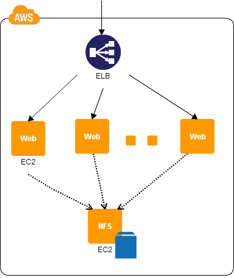
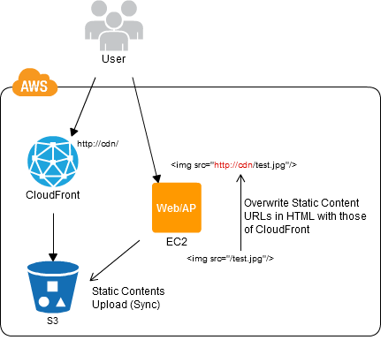
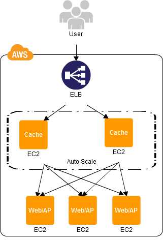

# Clone_Server_Pattern

# NFS_Sharing_Pattern

# NFS_Replica_Pattern

# State_Sharing_Pattern

# URL_Rewriting_Pattern

# Rewrite_Proxy_Pattern

# Cache_Proxy_Pattern

# Scheduled_Scale_Out_Pattern

